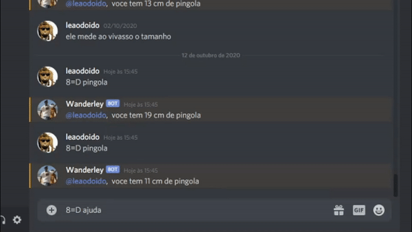

 <h2>Bot wanderley</h2> 
<h3>O bot que so da ideia errada</h3>

<h3>Como rodar o bot</h3>
<h4>Iniciando o bot</h4>

Instale o node.js, Você pode baixar diretamente desse link: https://nodejs.org/en/download/

  

Abra o diretorio do projeto e crie um arquivo chamado .env

 

Abra o prompt de comando e vá ate a o diretorio do projeto e use o comando 

npm install -g

Espere finalizar e então use o comando

npm install -g nodemon

 

Ao finalizar basta escrever "nodemon" no prompt e o bot irá iniciar

